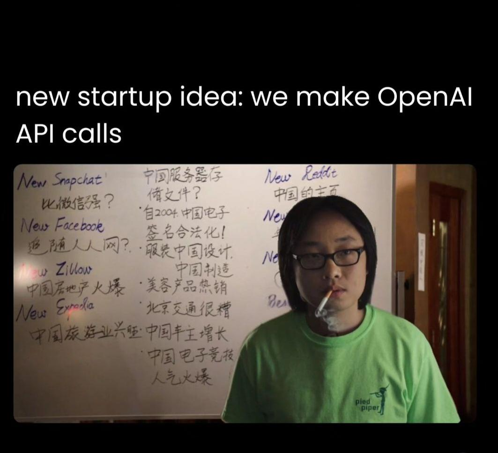

# [Server](https://github.com/skywalkerSam/dalleWrapper-server) for the [dalleWrapper](https://github.com/skywalkerSam/dalleWrapper) Project

- Use the "/test" endpoint

**Note:** the "/generate" endpoint doesn't work for reasons obvious ($);

## Until next time.)
